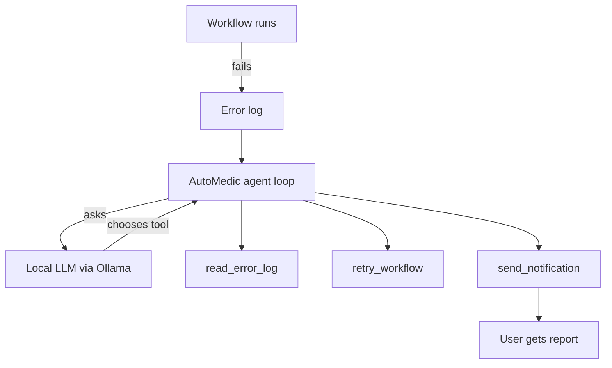

# Architecture

```mermaid
flowchart TD
    A[Workflow runs] -->|fails| B[Error log]
    B --> C[AutoMedic agent loop]
    C -->|asks| D[Local LLM via Ollama]
    D -->|chooses tool| C
    C --> E[read_error_log]
    C --> F[retry_workflow]
    C --> G[send_notification]
    G --> H[User gets report]
```

The agent loops: ask the model what to do, run the chosen tool, show the model the result, and repeat until a notification is sent.